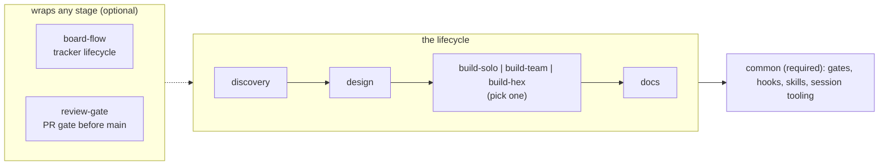
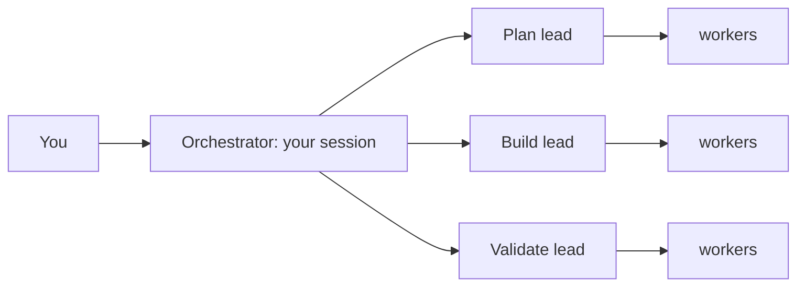

# Cepa

**Agentic engineering you can walk away from.**

A solo agent's most expensive habit is lying about "done": the test it *thinks* passed, the
half of the feature it forgot. Cepa gives Claude Code a team (planner, implementer, reviewer)
and puts mechanical gates around it, so that:

1. **"Done" is a checked fact, not a claim.** The agent cannot commit on a red build, cannot
   send a card to Review without a test for each requirement, and cannot mark its own work
   proven.
2. **The rules are locks, not requests.** They run as Claude Code hooks, outside the model.
   A prompt asks an agent to behave. A hook stops it when it doesn't.
3. **So you can step away.** Queue the work, let it run overnight, and come back to a short
   list of yes/no questions instead of a pile of diffs to read.

> *Cepa* (Portuguese): the rootstock, the living strain every vine is grown from. This is
> the strain your software teams are cultured from. *Don't hire a team. Culture one.*

## What you install



You need `common` and **one build team**. Everything else is optional: `discovery`, `design`
and `docs` are neighbouring teams that work before or after the build, and `board-flow` and
`review-gate` wrap whichever stages you use. Cepa works without Jira or any tracker.

## A day with Cepa

| When | Run | What happens |
|---|---|---|
| You have a vague idea | `/common:spec` | It interviews you until the idea is a buildable spec, with a failing test declared for every success criterion. Writes no code. |
| You have a messy backlog | `/board-flow:triage` | Reads every card, looks for evidence in the code, and sorts them: already built, ready, obsolete, needs your decision. |
| You want an order of work | `/common:plan` | Writes the queue to disk, with the reason each item sits where it sits. |
| "What now?" | `/common:next` | Names **one** next step. Never a menu. |
| You are going to sleep | `cepa-until my-queue --for 8h` (a terminal command) | Runs the queue for a time window, one fresh Claude process per item. |
| You are back | `/board-flow:decide` | Turns the Review column into a few yes/no questions, each with a recommendation. |
| End of day | `/common:wrap-up` | Commit, handoff note, merge and push behind one confirmation. |

Every one of these is also usable on its own. Full list: [docs/commands.md](docs/commands.md).

## Vibe coding hopes. Cepa locks.

Vibe coding is verification by feel: you accept the output because it looks right. With one
agent you can still read everything. With ten, generation multiplies and your ability to check
does not, so either you become the bottleneck or you stop checking. The second path is where
the hoping starts.

Putting a second model in front of the first does not fix it. A model approving another
model's work is still a probabilistic opinion, with correlated mistakes.

Cepa replaces opinion with observable fact:

- **green-or-revert.** The build exited zero, or it didn't. While it is red, commit and push
  are blocked. [More](docs/green-or-revert.md)
- **acceptance-completeness.** Each requirement has a test that demonstrates it *at the
  surface it was written for* (HTTP, CLI, UI), or the card does not reach Review.
  [More](docs/acceptance-completeness.md)
- **proof gate.** An independent reviewer breaks each change and re-runs the covering test.
  If nothing goes red, the change was not doing anything, and the card bounces back. The
  verdict is computed from what the tests did, not from what the reviewer says.
  [More](docs/proof-gate.md)
- **path-lock.** Each agent can write only inside its own folders. It also cannot edit the
  hooks that lock it.

Cepa does not need you to trust the model. The model proposes, the gate decides. You stay in
the loop as the judge of exceptions: a `NEEDS-HUMAN` verdict means only a person can settle
it, and that is all that reaches you.

### Which gate ships with which team

| Gate | `build-solo` | `build-team` | `build-hex` |
|---|---|---|---|
| green-or-revert | yes | yes | yes |
| acceptance-completeness | yes | yes | yes |
| UI proof (Playwright flows you declare in `docs/ui-proof.yaml`) | yes | yes | yes |
| path-lock by folder | tool allowlist only | yes | yes |
| proof gate on backend code (break it, require red) | no | no | **yes** |

The first three live in `common`, so every team gets them. The backend proof gate is tuned
for hexagonal Java/Quarkus today and ships only with `build-hex`.

### What the gates caught on a real project

One engineer, one client project, 13 Jul to 18 Sep 2026, from Cepa's own telemetry
(`/common:metrics`):

- **269 cards** went through the proof gate. **194** ended proven, **63** were handed to the
  human, **12** are still unproven.
- **54 cards (20%)** were bounced back at least once for a change no test could detect.
  32 of those were fixed and later proven.
- On **41 cards (15%)** the reviewing agent wrote "proven" and the mechanical guard computed
  a different verdict from the evidence and refused the file.

That last number is the argument in one line: the model was wrong about "done" on one card
in seven, and a lock caught it, not a person.


The same project on its tracker, one board: **4 cards done** in the five weeks before Cepa
started there (9 Jul to 11 Aug), **224 done** by 17 Sep. That is 220 cards in 36 days, about
43 a week, by one engineer. "Done" counts every card closed on the board, including the ones
triage found already built, which still had to pass the proof gate. Volume alone would be
the vibe-coding argument. It counts here because of the bounce numbers above it.
The chart is redrawn from card dates only ([data](docs/assets/flow-data.csv),
[script](docs/assets/make_flow.py)).

## Your attention is the scarce resource

Everything above exists so that fewer decisions reach you, and the ones that do arrive cheap.

- **Questions up front, in one batch.** `/common:session` asks everything at the start,
  including what the routine would only hit halfway, then runs to the end without stopping.
- **Reports written for someone who was not watching.** Plain-language opening, what is
  waiting on you, technical detail, then numbered yes/no questions, each with a
  recommendation.
- **It learns your preferences.** `/common:debrief` walks you through the decisions an
  unattended run made on its own. You answer keep, overrule or refine, and the verdict is
  stored in that agent's expertise file, which follows you across projects. Today's answer
  is one less question tomorrow.

## Run it with nobody awake

```sh
~/cepa/common/bin/cepa-until my-queue --for 12h   # or --until 07:00; --dry-run shows the plan
```

`cepa-until` is a terminal command, not a slash command (alias it). It runs the queue written by `/common:plan` for a **time window**. Each item runs
in a fresh `claude -p` process, so a full context window is the normal end of a subprocess
and not a failure. It cuts between items and never in the middle of one, stops after 3
failures in a row, and when the account's 5-hour usage cap hits it sleeps until the reset
instead of burning the night. The gates are what make this safe to leave alone.

Two things to know before you use it: it runs with `--dangerously-skip-permissions` by
default (turn that off with `--com-permissoes`), and it needs a queue on disk.
[More](docs/cepa-until.md)

## You have been here before

| The pain | In Cepa |
|---|---|
| Context runs out in the middle of a task | Automatic handoff per branch. The next session picks it up by itself. |
| "Where was I?" | `/common:next` names one step. `/common:recap` shows asked vs. delivered. |
| Two parallel sessions trample each other | One git worktree per session, conflict prediction, guarded merge. |
| The agent says "done" and it isn't | The gates above. |
| The agent edits what it shouldn't | Per-agent, per-folder write lock. |
| The agent asks something every five minutes | `/common:session`: all questions at the start, then no stops. |
| The agent burns the clock polling in a loop | A hook blocks busy-wait commands. |
| The 5-hour usage cap hits at 3 a.m. | `cepa-until` waits for the reset and won't start an item that doesn't fit. |
| An old backlog nobody knows is still valid | `/board-flow:triage` |
| A Review column clogged, waiting for you | `/board-flow:decide` |
| A tangent pollutes the main conversation | `/common:branch` forks it. `/common:return` brings back only the conclusion. |
| The tooling broke and you don't know where | `/common:doctor`, 30 seconds. |
| The tooling annoys you and the complaint gets lost | `/common:feedback`, one global ledger. |

## Pick a team

**Build teams: pick one per project.**

| If you're… | Use |
|---|---|
| Doing something small and scoped | **`build-solo`**: a dev and a reviewer |
| Building a feature, any stack | **`build-team`**: plan, build and validate leads, each with its own workers |
| On a hexagonal-architecture backend | **`build-hex`**: per-task quality loop, E2E specs and the backend proof gate |

`build-solo` and `build-team` differ by *size*. `build-hex` differs by *architecture
awareness*: it knows and enforces the ports/adapters layout.

Inside a team, your own Claude Code session is the orchestrator. **Leads** own a phase and
delegate; they never write code. **Workers** each do one job inside their own folders.



**Neighbouring teams: optional, before or after the build.**

| Team | What it does |
|---|---|
| **`discovery`** | Upstream: turns raw signals into validated opportunities and hands off a delivery brief |
| **`design`** | Turns a feature brief into a build-ready design spec (UX + visual) before engineering builds |
| **`docs`** | Sweeps an existing project into a grounded Diátaxis doc tree for onboarding |

**Wrappers: optional, around any stage.**

| Wrapper | What it adds |
|---|---|
| **`board-flow`** | Jira lifecycle: register, triage, execute, prove and decide cards through any team |
| **`review-gate`** | Code reaches main only through a reviewed, proven pull request |

Experimental: **`maestro`** plans four or more demands into waves of concurrent sessions. It
does not run end to end yet. See [docs/maestro.md](docs/maestro.md).

How to choose and combine: [docs/topologies.md](docs/topologies.md).

## Install

```sh
git clone https://github.com/alegomes/cepa.git ~/cepa
cd /path/to/your-project
~/cepa/bin/install.sh --topology=build-team     # or build-solo / build-hex
```

The installer registers the marketplace, installs the plugins, wires the team into your
project's `CLAUDE.md` and writes the marker files the commands read. Installing plugin by
plugin with `/plugin install <name>@cepa` also works, but leaves that project wiring to you.

→ **[Get started in 10 minutes](docs/getting-started.md)**

## Why a team that proves itself

We are building **a system that builds systems**: a strain you culture into a project that
grows the team that ships it. Compressing planner, implementer and reviewer into one agent
gets you mediocre versions of all three. Cepa packages the three-tier pattern (orchestrator,
leads, workers) so any Claude Code project can *install* a team, and the gates make that
team honest about what it has actually finished.

Edit once here, install in any project, version like normal code.

---

## Reference

| Document | Read it for |
|---|---|
| **[docs/getting-started.md](docs/getting-started.md)** | Install, pick a topology, run your first command. |
| **[docs/topologies.md](docs/topologies.md)** | Choosing between the build teams and composing the rest. |
| **[docs/commands.md](docs/commands.md)** | Every slash command, grouped by plugin. |
| **[docs/cepa-until.md](docs/cepa-until.md)** | Running the queue unattended for a time window. |
| **[docs/execution-plan.md](docs/execution-plan.md)** | The queue on disk: order, the `why` behind it, and the human debt a closed card leaves behind. |
| **[docs/green-or-revert.md](docs/green-or-revert.md)** | The build-state gate that blocks commits while the build is broken. |
| **[docs/acceptance-completeness.md](docs/acceptance-completeness.md)** | The per-card acceptance-evidence gate. |
| **[docs/proof-gate.md](docs/proof-gate.md)** | The change-driven proof gate for the Review column. |
| **[docs/board-flow.md](docs/board-flow.md)** | `board-flow.yaml` schema, `/configure`, Implementation Summary contract. |
| **[docs/autonomous-mode.md](docs/autonomous-mode.md)** | Unattended runs: `/autonomous-start` → checkpoint → `/autonomous-resume` → `/debrief`. |
| **[docs/handoff.md](docs/handoff.md)** | Session handoff: stop and pick up cleanly in a new session. |
| **[docs/maestro.md](docs/maestro.md)** | Experimental multi-session orchestration in waves. |
| **[docs/harness-ops.md](docs/harness-ops.md)** | Operational updates: the install record, `--rollback`, and what the doctor's `ops` check catches. |
| **[docs/incomprimivel.md](docs/incomprimivel.md)** | What each gate forbids compressing away, and the rule for growing a gate. |
| **[docs/precedencia-de-instrucoes.md](docs/precedencia-de-instrucoes.md)** | The five instruction layers, and the stop-and-surface rule on cross-layer conflict. |
| **[docs/versionamento.md](docs/versionamento.md)** | Which semver level a change bumps, and the "consciously excluded" release note. |
| **[docs/troubleshooting.md](docs/troubleshooting.md)** | Common errors: path-lock, gate-advance, cache staleness, MCP auth. |
| **[docs/internals/](docs/internals/)** | Extending the marketplace: architecture, hooks, path-lock, agent anatomy. |
| **[agents-overview.md](agents-overview.md)** | Per-agent reference: role, delegations, write allowlist, when-to-use. |

The mindset comes from indydev Dan's `lead-agents` pattern. Book-writing and git-history
analysis live in the separate **cepa-labs** marketplace.
