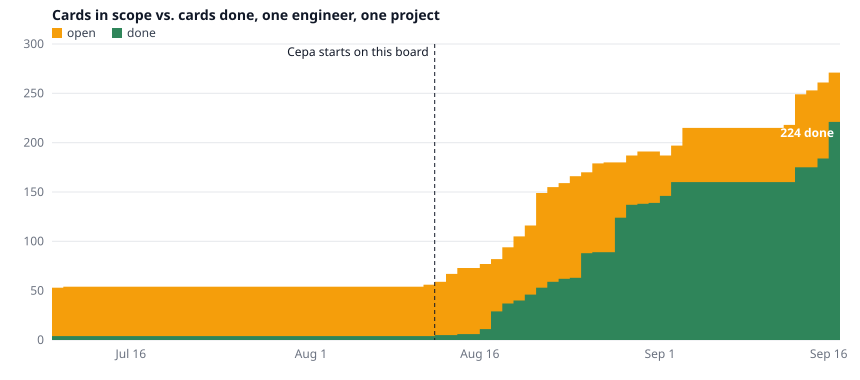
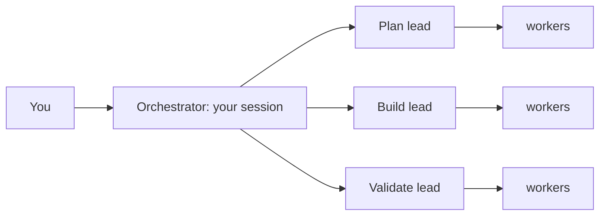
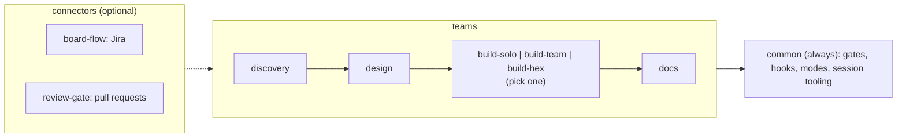

# Cepa

**Agentic engineering you can walk away from.**

A solo agent's most expensive habit is lying about "done": the test it *thinks* passed, the
half of the feature it forgot. Cepa gives Claude Code a team (planner, implementer, reviewer)
and puts mechanical gates around it, so that:

1. **"Done" is a checked fact, not a claim.** The agent cannot commit on a red build, cannot
   send a card to Review without a test for each requirement, and cannot mark its own work
   proven.
2. **The rules are locks, not requests.** They run outside the model. A prompt asks an agent
   to behave. A lock stops it when it doesn't.
3. **So you can step away.** Queue the work, let it run overnight, and come back to a short
   list of yes/no questions instead of a pile of diffs to read.

> *Cepa* (Portuguese): the rootstock, the living strain every vine is grown from. This is
> the strain your software teams are cultured from. *Don't hire a team. Culture one.*

## What Cepa is

Cepa is **a set of plugins for [Claude Code](https://docs.anthropic.com/en/docs/claude-code)**,
Anthropic's coding agent that runs in your terminal. It is not an app, a website or a hosted
service. There is no account and no server. You clone this repo, run one install script
inside your project, and keep using Claude Code as before. What changes is what Claude Code
can do and what it is no longer allowed to do.

A Claude Code plugin is a folder of text files and small scripts. Cepa's plugins contain
four kinds of thing:

| Piece | What it is | Example |
|---|---|---|
| **Agents** | Specialised sub-assistants your session delegates to. Each has one job, a limited set of tools and a list of folders it may write to. | `backend-dev`, `qa-engineer`, `proof-reviewer` |
| **Commands** | Slash commands you type in the session. Each runs a whole routine. | `/common:spec`, `/board-flow:triage` |
| **Hooks** | Scripts Claude Code runs *before* each action the agent takes, which can refuse it. These are the locks. The model cannot talk its way past them. | refusing `git commit` while the build is red |
| **Skills** | Working habits loaded into every agent. | report in plain language, stay in scope |

It also ships two terminal commands: `cepa`, a launcher you use instead of `claude` (it
declares the session's working mode and isolates parallel sessions from each other), and
`cepa-until`, which runs a queue of work overnight.

You need Claude Code, a git repository and Python 3. A tracker such as Jira is optional.

## Work has modes

Most wasted agent time comes from mixing three different moments: wandering around a
problem, converging on what to build, and building it. Do all three in one session and you
get a half-specified feature, built too early, interrupted every ten minutes by a question
the spec should have answered.

Cepa makes the moment explicit. Every session opens in one **mode** (`cepa --modo <name>`),
and the mode decides where the agent may write and what has to be true before the session
can close.

| Mode | The moment | You come in with | You leave with |
|---|---|---|---|
| **exploração** (exploration) | Wander. No solution yet. | A pain, in plain words | A strategy note with at least two paths considered and one recommended |
| **descoberta** (discovery) | Converge. | A behaviour you want | Acceptance criteria written at the surface where they will be checked, each with a failing test |
| **design** | Shape it before code exists. | A validated opportunity | Flows, states, visual spec, a prototype |
| **construção** (construction) | Make it real. | **A failing test**, written from the criterion by someone who will not implement it | Code and tests, passed by the acceptance and proof gates |
| **reforma** (refactor) | Reorganise delivered code. | A declared budget: the closed list of what changes | Same external behaviour. Editing an external test is blocked, because that would mean behaviour changed. |
| **reflexão** (reflection) | Look at what exists through one lens. | A slice and a lens | Every finding turned into a card or discarded with a reason |
| **documentação** (documentation) | Document stable code. | Code that is no longer moving | A doc tree where every "why" cites its source |

Two things follow from this:

- **Construction cannot start on a vague spec.** Its entry ticket is a failing test. That is
  what lets you hand over a large block of work and not be called back halfway to settle
  something that was never decided.
- **A tangent has somewhere to go.** When the agent, in construction mode, spots a refactor
  or an idea, it records it and keeps building. It neither does it now nor loses it.

In exploration and discovery the agent can only write under `docs/`, so "just a quick
prototype" does not leak into a session meant for thinking. Not every mode's exit check is
mechanical yet. [docs/modos-de-trabalho.md](docs/modos-de-trabalho.md) says which are.

## A week with Cepa

The commands below are the ones you would actually type, in the order the work happens.

**1. Turn an idea into something buildable.** Open a discovery session and run
`/common:spec`. It interviews you in rounds and writes every answer into a versioned
markdown file. It declares the spec ready only when each success criterion names the surface
where it can be observed (HTTP, CLI, UI) and a failing test for it. It writes no code.

**2. Or start from the backlog you already have.** `/board-flow:triage` reads every card in
a column, searches the code and git history for evidence, and sorts the cards: already
built, ready to build, obsolete, needs your decision. Only the last group comes to you, as
questions.

**3. Put the work in order.** `/common:plan` writes the queue to a file in the repo, with
the reason each item sits where it sits. A tracker keeps cards. It does not keep *why this
one is next*. From here on `/common:next` answers "what now?" with one step, never a menu.

**4. Build one item.** `/board-flow:execute PROJ-123` (or `/build-team:plan-build-validate
"<description>"` with no tracker). Your session plans with the planning lead, the
engineering lead splits the work among workers locked to their own folders, the validation
lead tests and security-reviews. The card moves to Review only with a test demonstrating
each requirement.

**5. Prove it.** `/board-flow:prove PROJ-123`. An independent reviewer that did not write
the code breaks each change and re-runs the tests. Proven cards advance. Unproven cards go
back with the gap named. `/board-flow:prove-drain` does the whole Review column.

**6. Go to sleep.** `cepa-until my-queue --until 07:00` runs steps 4 and 5 for every item
in the queue, one fresh Claude process per item, until the clock runs out.

**7. Come back.** `/board-flow:decide` reads what is sitting in Review, drops what is
nobody's decision (Docker was down, a tool was missing), groups the rest by reason and asks
**one yes/no question per group**, with a recommendation. You answer "1 yes, 2 no" and it
applies.

**8. Teach it.** `/common:debrief` walks you through the judgement calls the unattended run
made on its own. Keep, overrule or refine. Your verdicts are stored per agent and bias the
next run.

**9. Close.** `/common:wrap-up`: commit, handoff note for the next session, merge and push,
behind one confirmation.

All commands, grouped by what you are trying to do: [docs/commands.md](docs/commands.md).

## Vibe coding hopes. Cepa locks.

Vibe coding is verification by feel: you accept the output because it looks right. With one
agent you can still read everything. With ten, generation multiplies and your ability to check
does not, so either you become the bottleneck or you stop checking. The second path is where
the hoping starts.

Putting a second model in front of the first does not fix it. A model approving another
model's work is still a probabilistic opinion, with correlated mistakes.

Cepa replaces opinion with observable fact:

- **green-or-revert.** The build exited zero, or it didn't. While it is red, commit and push
  are blocked. [More](docs/green-or-revert.md)
- **acceptance-completeness.** Each requirement has a test that demonstrates it *at the
  surface it was written for* (HTTP, CLI, UI), or the card does not reach Review.
  [More](docs/acceptance-completeness.md)
- **proof gate.** An independent reviewer breaks each change and re-runs the covering test.
  If nothing goes red, the change was not doing anything, and the card bounces back. The
  verdict is computed from what the tests did, not from what the reviewer says.
  [More](docs/proof-gate.md)
- **path-lock.** Each agent can write only inside its own folders. It also cannot edit the
  hooks that lock it.

Cepa does not need you to trust the model. The model proposes, the gate decides. You stay in
the loop as the judge of exceptions: a `NEEDS-HUMAN` verdict means only a person can settle
it, and that is all that reaches you.

### What the gates caught on a real project

A claim like the one above is cheap, so here is what happened when it met real work: one
engineer, one client's product (a Java backend and a browser extension), 13 Jul to
18 Sep 2026. The numbers come from the log Cepa's own hooks keep (`/common:metrics`).

First, what happens to a card in Review. The proof reviewer takes the card's diff. For each
changed behaviour it deliberately breaks the code (flips a condition, removes a line) and
runs the tests that are supposed to cover it. A test must go red. If everything stays green
with the code broken, then either the change does nothing or nothing would notice if it
stopped working. The reviewer records what it broke and what went red, and a hook computes
the verdict from that record.

**269 cards** went through this. What came out:

| What happened | Cards | What it means |
|---|---|---|
| Bounced back at least once | **54 (20%)** | The work was built, reviewed and declared done, and it contained a change no test could detect. With no proof gate these 54 would be in main today, labelled done. 32 of them were fixed and later proven. |
| The reviewer wrote "proven" and the hook refused it | **41 (15%)** | The reviewing agent concluded the card was proven, and the evidence it had recorded itself did not support that. A hook recomputed the verdict and rejected the file. This is a model being wrong about "done" and a lock catching it. |
| Ended proven | 194 | Every changed behaviour has a test that fails without it. |
| Handed to the human | 63 | Things only a person can settle, delivered as grouped yes/no questions. |
| Still unproven | 12 | Back in progress. |

So what? On one card in five, a full team of agents with code review and a green build
still shipped something unprotected. On one card in seven, the reviewing model itself said
"proven" when it wasn't. If your process ends at "the agent says it's done and the tests
pass", this is the share of your work that is wrong without anybody knowing. It is not a
flaw of this project. It is the base rate of trusting a model's word.

And it did not cost speed:



One board of that product, from the day work started (14 Aug) to 17 Sep: from 5 cards done
to **224 done**. That is 219 cards in 31 days, about 49 a week, by one engineer, with every
one of them passing through the gates above. Four days when the engineer was travelling and
nothing ran are cut from the axis and marked. "Done" includes cards that triage found
already built, which still had to be proven. The chart is drawn from card dates only
([data](docs/assets/flow-data.csv), [script](docs/assets/make_flow.py)).

## Your attention is the scarce resource

Everything above exists so that fewer decisions reach you, and the ones that do arrive cheap.

- **Questions up front, in one batch.** `/common:session` asks everything at the start,
  including what the routine would only hit halfway, then runs to the end without stopping.
- **Reports written for someone who was not watching.** Plain-language opening, what is
  waiting on you, technical detail, then numbered yes/no questions, each with a
  recommendation.
- **It learns your preferences.** `/common:debrief` walks you through the decisions an
  unattended run made on its own. You answer keep, overrule or refine, and the verdict is
  stored in that agent's expertise file, which follows you across projects. Today's answer
  is one less question tomorrow.

## Run it with nobody awake

```sh
~/cepa/common/bin/cepa-until my-queue --for 12h   # or --until 07:00; --dry-run shows the plan
```

`cepa-until` is a terminal command, not a slash command (alias it). It runs the queue
written by `/common:plan` for a **time window**. Each item runs in a fresh `claude -p`
process, so a full context window is the normal end of a subprocess and not a failure. It
cuts between items and never in the middle of one, stops after 3 failures in a row, and when
the account's 5-hour usage cap hits it sleeps until the reset instead of burning the night.
The gates are what make this safe to leave alone.

Two things to know before you use it: it runs with `--dangerously-skip-permissions` by
default (turn that off with `--com-permissoes`), and it needs a queue on disk.
[More](docs/cepa-until.md)

## You have been here before

| The pain | In Cepa |
|---|---|
| Context runs out in the middle of a task | Automatic handoff per branch. The next session picks it up by itself. |
| "Where was I?" | `/common:next` names one step. `/common:recap` shows asked vs. delivered. |
| Two parallel sessions trample each other | The `cepa` launcher gives each session its own git worktree when needed, with conflict prediction and a guarded merge. |
| The agent says "done" and it isn't | The gates above. |
| The agent edits what it shouldn't | Per-agent, per-folder write lock. |
| You start specifying, jump to coding, then polish docs before the code works | Modes. The session has one purpose and tangents get recorded, not followed. |
| The agent asks something every five minutes | `/common:session`: all questions at the start, then no stops. |
| The agent burns the clock polling in a loop | A hook blocks busy-wait commands. |
| The 5-hour usage cap hits at 3 a.m. | `cepa-until` waits for the reset and won't start an item that doesn't fit. |
| An old backlog nobody knows is still valid | `/board-flow:triage` |
| A Review column clogged, waiting for you | `/board-flow:decide` |
| A tangent pollutes the main conversation | `/common:branch` forks it. `/common:return` brings back only the conclusion. |
| The tooling broke and you don't know where | `/common:doctor`, 30 seconds. |
| The tooling annoys you and the complaint gets lost | `/common:feedback`, one global ledger. |

## What you install

Cepa is split into plugins so you install only what your project needs. There are three
kinds.

**The base: `common`. Always installed.** It holds what is shared by everything else: the
gates (green-or-revert, acceptance-completeness, UI proof), the hooks, the working habits,
the modes, and the session tooling (`/common:spec`, `plan`, `next`, `session`, `wrap-up`,
handoff, worktrees, `cepa-until`).

**A team.** A team is a plugin that ships a group of agents plus the instructions that tell
your Claude Code session how to delegate to them. You do not talk to the agents. You talk to
your session as usual, and it becomes the **orchestrator**: it hands each phase to a
**lead** (an agent that plans and delegates but never writes code), and the lead hands
pieces to **workers** (agents that each do one job and can write only in their own folders).



Pick **one build team** per project:

| If you're… | Use | Gates on top of `common`'s |
|---|---|---|
| Doing something small and scoped | **`build-solo`**: a dev and a reviewer, no leads | none (the reviewer is read-only) |
| Building a feature, any stack | **`build-team`**: plan, build and validate leads, each with its own workers | folder write locks |
| On a hexagonal-architecture backend | **`build-hex`**: per-task quality loop, E2E specs | folder write locks + **the proof gate on backend code** |

The proof gate described above (break the code, require a red test) is tuned for hexagonal
Java/Quarkus today and ships only with `build-hex`. The UI version of it, which drives
Playwright flows you declare in `docs/ui-proof.yaml`, is in `common` and works with any team.

Three more teams cover the work around the build. They are optional, and each one is the
team behind one of the modes:

| Team | Mode | What it does |
|---|---|---|
| **`discovery`** | descoberta | Turns raw signals into validated opportunities and hands engineering a delivery brief |
| **`design`** | design | Turns a feature brief into a build-ready design spec (flows, visual, prototype, critique) |
| **`docs`** | documentação | Sweeps an existing project into a grounded doc tree for onboarding, in five checkpointed phases |

**A connector.** A connector ships no builders. It connects whichever team you installed to
an outside system, and owns the only agent allowed to touch that system.

| Connector | Connects to | What you get |
|---|---|---|
| **`board-flow`** | Jira | Commands that take a card as input. `/board-flow:execute PROJ-123` reads the card, runs your team's build flow, moves the card through the columns and posts an implementation summary. Also `triage`, `prove`, `decide`, `drain`. |
| **`review-gate`** | Bitbucket pull requests | `/review-gate:open` reviews the diff and opens the PR. `/review-gate:merge` merges only after the proof gate says PROVEN. |

How the pieces sit together:



Experimental: **`maestro`** plans four or more demands into waves of concurrent sessions. It
does not run end to end yet. See [docs/maestro.md](docs/maestro.md).

How to choose and combine: [docs/topologies.md](docs/topologies.md).

## Install

```sh
git clone https://github.com/alegomes/cepa.git ~/cepa
cd /path/to/your-project
~/cepa/bin/install.sh --topology=build-team     # or build-solo / build-hex
```

The installer registers the plugins with Claude Code, wires the team into your project's
`CLAUDE.md`, writes the marker files the commands read, and tells you where the `cepa` and
`cepa-until` commands are. Installing plugin by plugin with `/plugin install <name>@cepa`
also works, but leaves that project wiring to you.

→ **[Get started in 10 minutes](docs/getting-started.md)**

## Why a team that proves itself

We are building **a system that builds systems**: a strain you culture into a project that
grows the team that ships it. Compressing planner, implementer and reviewer into one agent
gets you mediocre versions of all three. Cepa packages the three-tier pattern (orchestrator,
leads, workers) so any Claude Code project can *install* a team, and the gates make that
team honest about what it has actually finished.

Edit once here, install in any project, version like normal code.

## Credits

The central insight of this project came out of the working sessions around
[Mirror Mind](https://github.com/mirror-mind-ai/mirror), with Alisson Vale, Henrique Bastos,
Vinicius Teles and Klaus Wuestefeld. The orchestrator, leads and workers pattern comes from
indydev Dan's `lead-agents`.

Book-writing and git-history analysis live in the separate **cepa-labs** marketplace.

---

## Reference

| Document | Read it for |
|---|---|
| **[docs/getting-started.md](docs/getting-started.md)** | Install, pick a topology, run your first command. |
| **[docs/topologies.md](docs/topologies.md)** | Choosing between the build teams and composing the rest. |
| **[docs/commands.md](docs/commands.md)** | Every command: first by what you are trying to do, then the full reference by plugin. |
| **[docs/modos-de-trabalho.md](docs/modos-de-trabalho.md)** | The working modes: what each one asks to enter, produces, and needs to close. (Portuguese.) |
| **[docs/cepa-until.md](docs/cepa-until.md)** | Running the queue unattended for a time window. |
| **[docs/execution-plan.md](docs/execution-plan.md)** | The queue on disk: order, the `why` behind it, and the human debt a closed card leaves behind. |
| **[docs/green-or-revert.md](docs/green-or-revert.md)** | The build-state gate that blocks commits while the build is broken. |
| **[docs/acceptance-completeness.md](docs/acceptance-completeness.md)** | The per-card acceptance-evidence gate. |
| **[docs/proof-gate.md](docs/proof-gate.md)** | The change-driven proof gate for the Review column. |
| **[docs/board-flow.md](docs/board-flow.md)** | `board-flow.yaml` schema, `/configure`, Implementation Summary contract. |
| **[docs/autonomous-mode.md](docs/autonomous-mode.md)** | Unattended runs: `/autonomous-start` → checkpoint → `/autonomous-resume` → `/debrief`. |
| **[docs/handoff.md](docs/handoff.md)** | Session handoff: stop and pick up cleanly in a new session. |
| **[docs/maestro.md](docs/maestro.md)** | Experimental multi-session orchestration in waves. |
| **[docs/harness-ops.md](docs/harness-ops.md)** | Operational updates: the install record, `--rollback`, and what the doctor's `ops` check catches. |
| **[docs/incomprimivel.md](docs/incomprimivel.md)** | What each gate forbids compressing away, and the rule for growing a gate. |
| **[docs/precedencia-de-instrucoes.md](docs/precedencia-de-instrucoes.md)** | The five instruction layers, and the stop-and-surface rule on cross-layer conflict. |
| **[docs/versionamento.md](docs/versionamento.md)** | Which semver level a change bumps, and the "consciously excluded" release note. |
| **[docs/troubleshooting.md](docs/troubleshooting.md)** | Common errors: path-lock, gate-advance, cache staleness, MCP auth. |
| **[docs/internals/](docs/internals/)** | Extending the marketplace: architecture, hooks, path-lock, agent anatomy. |
| **[agents-overview.md](agents-overview.md)** | Per-agent reference: role, delegations, write allowlist, when-to-use. |

