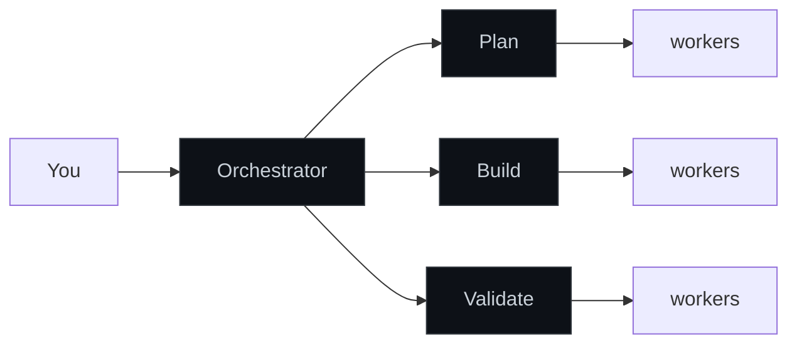

# Cepa

**Give Claude Code a team instead of a single agent — one that proves its own work.**

One Claude writes the code, reviews it, and tells you it's done. That's three mediocre
jobs in one. **Cepa** splits the work the way a real team does — a planner, an implementer,
a reviewer — and adds the thing a solo agent can't do: **it refuses to call something
"done" until it can prove it.**

> *Cepa* (Portuguese): the rootstock — the living strain every vine is grown from. This is
> the strain your software teams are cultured from. *Don't hire a team. Culture one.*



The orchestrator routes the work. **Leads** own a phase and delegate — they never write code
themselves. **Workers** are domain-locked: each does one job, inside its own lane.

## The part that matters

A solo agent's most expensive habit is lying about "done" — the test it *thinks* passed,
the half of the feature it forgot. Cepa won't let it:

- **green-or-revert** — can't commit or push while the build is red. No "I think the tests pass."
- **acceptance-completeness** — a card can't reach Review until a test actually demonstrates
  each requirement, *at the surface it was written for*.
- **proof gate** — before anything ships, an independent reviewer **breaks each change and
  re-runs the covering test**. If nothing goes red, the change wasn't doing anything — it
  bounces back.

Most agent swarms generate. Cepa generates *and disproves its own work before trusting it.*

## Pick a team

Cepa is a marketplace of composable plugins on two shelves.

### Shelf 1 — pick a build team

| If you're… | Use | Shape |
|---|---|---|
| Doing something small and scoped | **`build-solo`** | dev + reviewer (2 agents) |
| Building a feature, any stack | **`build-team`** | orchestrator + 3 leads + 6 workers |
| On a hexagonal-architecture backend | **`build-hex`** | 14 agents, per-task quality loop + proof gate |

`build-solo` and `build-team` differ by *size*; `build-hex` differs by *architecture-awareness* —
it knows and enforces the ports/adapters layout, with the heaviest rigor (proof-reviewer, E2E specs).

### Shelf 2 — add a layer (compose onto any team)

| Layer | What it adds |
|---|---|
| **`discovery`** | Upstream: turn raw signals into validated opportunities, hand off a delivery brief |
| **`design`** | Turn a feature brief into a build-ready design spec (UX + visual), before engineering builds |
| **`docs`** | Sweep an existing project into a grounded Diátaxis doc tree for onboarding |
| **`board-flow`** | Jira/tracker lifecycle — register, transition, and drive cards through any topology |
| **`review-gate`** | Pre-merge gate — code reaches main only through a reviewed, proven PR |
| **`common`** | The substrate every plugin needs: mindset skills, the gates, the hooks |

These trace the product lifecycle — **discover → design → build → document** — with `board-flow`
and `review-gate` wrapping any stage. (A go-to-market / content stage is on the roadmap.)

→ **[Get started in 10 minutes](docs/getting-started.md)**

```sh
# install the marketplace, then a team + the layers you want
/plugin marketplace add /path/to/this-repo
/plugin install common@cepa        # required substrate
/plugin install build-team@cepa    # or build-solo / build-hex
/plugin install board-flow@cepa    # optional layers
```

Or run `bin/install.sh --topology=build-team /path/to/your-project` to wire a project in one shot.

---

## Reference

| Document | Read it for |
|---|---|
| **[docs/getting-started.md](docs/getting-started.md)** | Install, pick a topology, run your first command. |
| **[docs/topologies.md](docs/topologies.md)** | Choosing between the build teams and composing the layers. |
| **[docs/commands.md](docs/commands.md)** | Every slash command, grouped by plugin. |
| **[docs/maestro.md](docs/maestro.md)** | Multi-harness orchestration: plan ≥4 demands into waves of concurrent sessions, run them with one action. |
| **[docs/board-flow.md](docs/board-flow.md)** | `board-flow.yaml` schema, `/configure`, Implementation Summary contract. |
| **[docs/green-or-revert.md](docs/green-or-revert.md)** | The build-state gate that blocks commits while the build is broken. |
| **[docs/acceptance-completeness.md](docs/acceptance-completeness.md)** | The per-card acceptance-evidence gate. |
| **[docs/proof-gate.md](docs/proof-gate.md)** | The change-driven proof gate for the Review column. |
| **[docs/autonomous-mode.md](docs/autonomous-mode.md)** | Unattended runs: `/autonomous-start` → checkpoint → `/autonomous-resume` → `/debrief`. |
| **[docs/handoff.md](docs/handoff.md)** | Session handoff: stop and pick up cleanly in a new session. |
| **[docs/harness-ops.md](docs/harness-ops.md)** | Operational updates: the install record, `--rollback`, and what the doctor's `ops` check catches. |
| **[docs/incomprimivel.md](docs/incomprimivel.md)** | What each gate forbids compressing away, and the rule for growing a gate. |
| **[docs/precedencia-de-instrucoes.md](docs/precedencia-de-instrucoes.md)** | The five instruction layers, and the stop-and-surface rule on cross-layer conflict. |
| **[docs/versionamento.md](docs/versionamento.md)** | Which semver level a change bumps, and the "consciously excluded" release note. |
| **[docs/troubleshooting.md](docs/troubleshooting.md)** | Common errors: path-lock, gate-advance, cache staleness, MCP auth. |
| **[docs/internals/](docs/internals/)** | Extending the marketplace: architecture, hooks, path-lock, agent anatomy. |
| **[agents-overview.md](agents-overview.md)** | Per-agent reference: role, delegations, write allowlist, when-to-use. |

## Plugins

| Plugin | Role |
|---|---|
| `common` | Shared mindset skills + gates + hooks; ships `completion-auditor`. Required by every topology. |
| `build-solo` | 2-agent dev/reviewer pair for small tasks. |
| `build-team` | Generic 9-agent topology: orchestrator + 3 leads + 6 domain-locked workers. |
| `build-hex` | 14-agent hexagonal-architecture topology with per-task quality loop + standalone proof-reviewer. |
| `discovery` | 6-agent continuous product-discovery topology (sits upstream of the build teams). |
| `design` | 6-agent product-design topology (brief → build-ready spec). |
| `docs` | Documentation/onboarding topology → grounded Diátaxis tree. |
| `board-flow` | `atlassian-expert` + Jira-aware commands; layers onto any topology. |
| `review-gate` | Pre-merge PR gate with a quarantined `bitbucket-expert` adapter. |
| `maestro` | Multi-harness orchestration: plan ≥4 demands into waves of concurrent sessions, run them with one action, gated by intake + a permission gatekeeper. Not yet live end-to-end (step 4 unrun). See [docs/maestro.md](docs/maestro.md). |

> Book-writing and git-history analysis used to live here. They're narrative/analysis tools
> off the product-lifecycle spine, so they were split into the separate **cepa-labs**
> marketplace ([claude-standalone-topologies](../claude-standalone-topologies)).

Edit once here, install in any project, version like normal code.

## Why a team that proves itself

We are building **a system that builds systems** — a strain you culture into a project that
grows the team that ships it. Software worth shipping needs more than one perspective, and
compressing planner + implementer + reviewer into one agent gets you mediocre versions of
all three. Cepa packages the three-tier pattern (orchestrator → leads → workers) so any
Claude Code project can *install* a team rather than hire one — and the gates make that team
honest about what it has actually finished.

The mindset comes from indydev Dan's `lead-agents` pattern. The Claude Code adaptation ports
the agents, the path-lock hooks, and the shared mindset skills, and adds the green-or-revert,
acceptance-completeness, and proof gates that make "done" mean *proven*.
