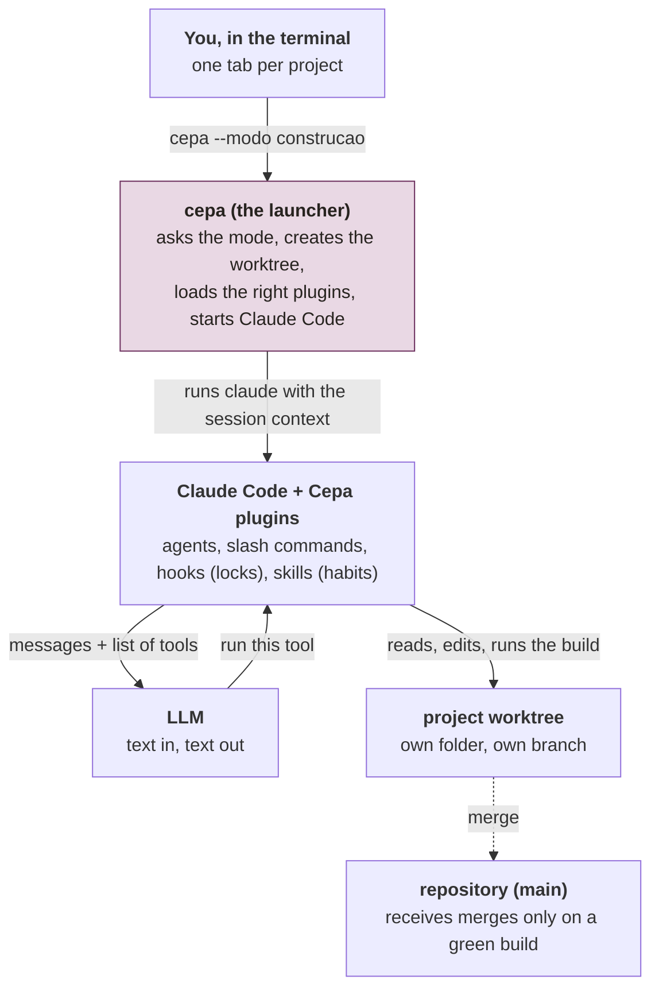
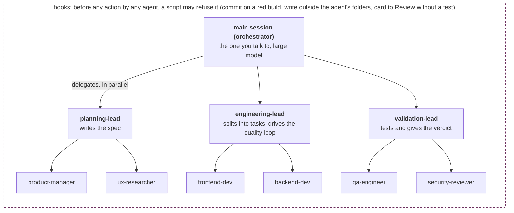
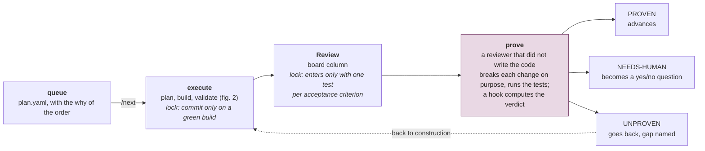
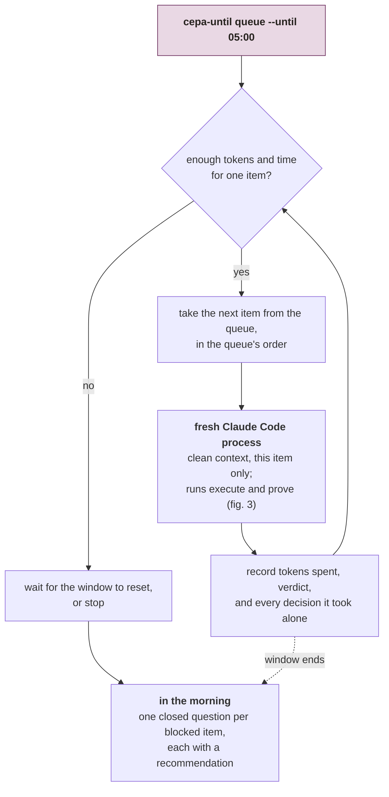
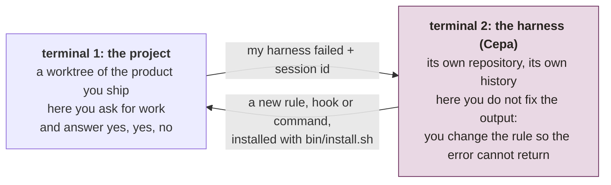

# How the pieces fit

One page, five pictures. Each of the other documents explains one part of Cepa in depth;
this one shows how the parts connect, from the terminal you type in to the model that
answers, and from a card in the queue to a proven merge. Read it first if you have never
seen Cepa run, or when you need to explain it to someone else.

## Vocabulary

| Word | What it is |
|---|---|
| **Cepa** | A set of plugins for Claude Code plus two terminal commands. A repository of its own, separate from the projects it works on. |
| **plugin** | A folder of text files and small scripts that Claude Code loads: agents, slash commands, hooks and skills. |
| **marketplace** | A repository that lists plugins to install from. Cepa is one marketplace with eleven plugins; each project picks the ones it needs. |
| **hook** | A script Claude Code runs before or after an action, which can refuse it. The lock. The model cannot argue with a hook. |
| **mode** | What a session is for (exploration, discovery, construction, refactor, ...). It decides where the agent may write and what must be true before the session can close. See [modos-de-trabalho.md](modos-de-trabalho.md). |
| **worktree** | A separate folder of the same repository on its own branch. Two sessions in two worktrees never step on each other. |
| **plan.yaml** | The work queue: the order of the items and the reason each one sits where it sits. See [execution-plan.md](execution-plan.md). |
| **cepa-until** | The command that runs the queue item by item until a clock time. The thing that works overnight. See [cepa-until.md](cepa-until.md). |
| **proof** | An independent reviewer deliberately breaks each change and re-runs the tests. If nothing goes red, the change is unprotected and the card bounces. See [proof-gate.md](proof-gate.md). |

## 1. The layers, from you to the model

The model never touches a file. Claude Code does, on the model's request. Cepa does not
replace Claude Code: it prepares the session and loads what changes Claude Code's behaviour
and what it is no longer allowed to do. The main branch only receives what passed the locks.

## 2. Inside a session: who delegates to whom

Workers run on a smaller, cheaper model than the leads: a simple task goes to a cheap model
and a hard one to an expensive model, decided by position in the hierarchy rather than by
guesswork at prompt time. Each worker can write only inside its own folders (the path-lock
hook), and no agent can edit the hooks that lock it. The picture shows `build-team`; the
other topologies have the same shape with different counts (`build-solo` has two agents,
`build-hex` has fourteen). See [topologies.md](topologies.md).

## 3. The path of a card

On one real project, 269 cards went through this. One in five was bounced by the proof gate
after being built, reviewed and declared done on a green build; on one in seven the
reviewing agent itself wrote "proven" and the hook refused the file. The numbers and their
source are in the [README](../README.md#what-the-gates-caught-on-a-real-project). This is
why nobody needs to read the diff: the proof reads it.

## 4. The night: what runs while nobody is awake

The provider enforces a 5-hour window and a 7-day window. Before each item the loop checks
whether the item fits in both; if not, it waits instead of doing half a job. Each item runs
in a new process, so the queue does not tire the way one long conversation does.

## 5. The two terminals

The project never receives a correction typed into a conversation. It receives a new version
of the harness. Cepa is built inside Cepa: terminal 2 has its own queue, its own nights and
its own proof gate.

## What lives where

The question to ask of every file: is this about this project, or about the way I work?

- **In Cepa (valid in every project):** the agents and their hierarchy, the slash commands,
  the locks, the report format, the session modes, the overnight loop.
- **In the project:** that repository's instruction file, the board configuration (which
  tracker, which columns), that project's queue, and the specs and proof records of each card.

Cepa is one point of arrival, not the path. It grew out of months of "what can be better
today than yesterday", one piece per real annoyance. A harness grown from someone else's
annoyances will look different, and should.
