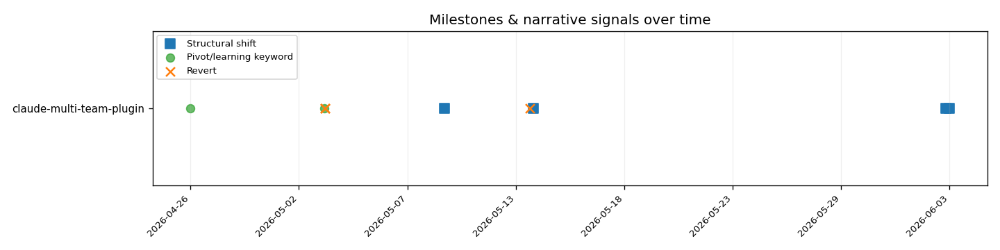

# claude-multi-team-plugin — The Story So Far

**TL;DR.** Over roughly five and a half weeks (2026-04-26 → 2026-06-03, 101 commits, a single author), this repository grew from a single-agent README-and-config skeleton into a multi-plugin marketplace. The shape of the work tells a three-act arc: a short **scaffolding** burst, a sustained **multi-team build-out** that peaked in mid-May, and a late **hardening-and-expansion** stretch where structural enforcement (a "green-or-revert" gate) and a brand-new `git-history` plugin landed. The history is on a `linear/rebase` workflow — no merge commits at all — so this is a story told through commit subjects and effort *shape*, not branch topology.

---

## A note on what this is built from

Everything below rests on Git proxies: commit counts, lines changed (churn), an estimated-hours heuristic, and keyword hits in commit subjects. None of these is ground truth. One author, working locally, with history that has been rebased flat (zero merges, zero squash markers) — so I can see *what changed and roughly when*, but not the branching, the dead ends that never got committed, or the intent behind any single move. Where I cross from "the data shows" into "this probably means," I mark it as **Inference**.

---

## Act I — Scaffolding (week of 2026-04-26, W17)

**What the data shows.** The repo opens quietly: 2 commits, ~1,300 lines of churn, the lowest-effort week in the whole span (~1.1 estimated hours). The earliest touched areas are the plugin skeleton — `.claude-plugin`, `agents`, `commands`, `skills`, `hooks` — all first appearing on day one (2026-04-26). A keyword signal lands almost immediately: *"docs: rewrite README around local-path setup workflow."*

> **Inference.** This looks like a deliberate framing decision up front — the project is being set up as a *local-path* tool rather than a published one. That reading is reinforced later (see Act II), but on its own a single "rewrite" commit is just a hint.

## Act II — The multi-team build-out (W18–W20, early-to-mid May)

**What the data shows.** This is where the project comes alive. W18 jumps to 27 commits (~14 est. hours) and W19 is the single busiest week of the entire history: **33 commits, ~6,100 churn, ~19.5 estimated hours** — the global peak on every metric. Effort concentrates in `common` (33 commits overall, the most-committed area), `hex-backend`, `jira-flow`, `multi-team`, and a short-lived `solo-pair` area (10 commits, all inside 2026-05-01 → 2026-05-03, then silent).

Two signal clusters sit right on top of this peak:
- A keyword commit on 2026-05-03: *"Local-only install; drop GitHub-publish framing"* (categorised **abandon**).
- A run of reverts on 2026-05-03: reverting agent Write-paths back to `.claude/expertise`, and *"Revert versions to 0.1.0 and refresh audit with empirical findings."*

> **Inference.** The "drop GitHub-publish framing" commit plus the version-reset revert *suggest* a course correction early in this phase: the project consciously committed to local-only distribution and walked back some premature versioning/path decisions. The `solo-pair` area firing and going quiet within three days *looks like* an experiment that was tried and set aside — but Git can't tell me whether it was abandoned, renamed, or folded into another area. W20 reinforces a transition: commits drop to 5 even as churn stays high (~4,800), which usually means a few large, consolidating changes rather than many small ones.

## Act III — Hardening and expansion (W21–W24, mid-May → 2026-06-03)

**What the data shows.** After a quiet W21 (3 commits), activity surges again in W22 (24 commits, ~11.7 est. hours) before tapering through W23 (7 commits) to the final days. The defining late events are *structural*:
- `book` introduced late (2026-05-09, ~1,090 churn) and `docs` introduced late (2026-05-13, the largest single area by churn at **5,341** across 16 commits).
- A revert-category signal on 2026-05-13: *"feat(common): green-or-revert — structural gate against optimistic claims."*
- On the very last day (2026-06-03), `git-history` appears as a brand-new area — 1,371 churn in a single commit — alongside a tiny `.claude` addition.

> **Inference.** The late arrival of `docs` and `book` as heavy areas *suggests* the project shifted from building features to explaining and packaging them — a maturation move. The "green-or-revert" commit, despite the word "revert," reads as the opposite of a rollback: it's an *enforcement mechanism* being added ("structural gate against optimistic claims"). And the single-commit `git-history` drop on the final day is almost certainly *this very analysis plugin* being committed — a new capability landing fully-formed, which on a rebased history can mean it was developed elsewhere and squashed in. The Git record can't confirm any of that intent; it only shows where the lines moved.

---

## Where the tensions are (for the reader's judgement)

- **Commits vs churn disagree in W20.** Few commits, high churn — I read it as consolidation, but it could equally be one large generated/vendored change. Worth a human glance at W20's diffs.
- **`linear/rebase` flattens the branch story.** Zero merges means any parallel exploration is invisible. The "introduced-late" signals are real, but *how* those areas were developed (incrementally vs dropped in whole) is unknowable from this history.
- **Single author, local-only.** Effort proxies here reflect one person's committing rhythm, not team load-balancing. The estimated-hours figures are a heuristic, not timesheet data.

See `relatorio.md` for the effort tables and the per-area / per-week breakdown.
