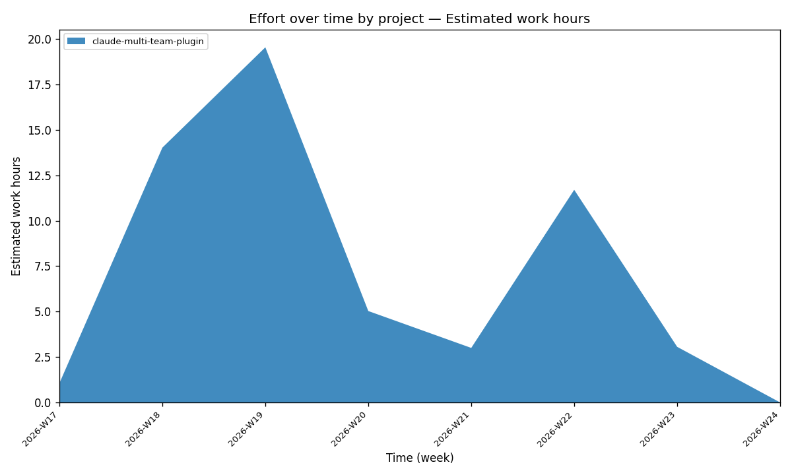
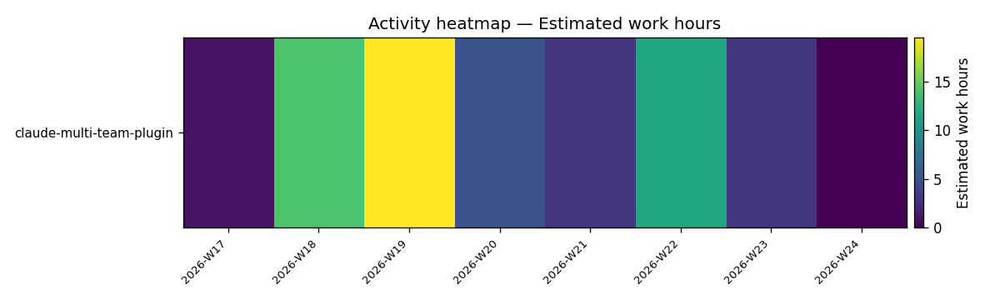

# claude-multi-team-plugin — Effort Analysis

**Scope.** 1 repository, 1 author, 101 commits. Span 2026-04-26 → 2026-06-03 (38 days). Granularity: **week** (8 ISO periods, W17–W24). Workflow: **linear/rebase** (0 merge commits, 0 squash markers).

**Metric.** The primary metric is **estimated work-hours** — a heuristic derived from commit timing and churn, *not* measured time. Treat all figures as **proxies**: commits, churn (lines changed), and est. hours each approximate "effort" from a different angle and can disagree. Where they disagree, both are shown.

---

## Effort by period (week)

| Period | Commits | Churn | Est. hours |
|---|---:|---:|---:|
| 2026-W17 | 2 | 1,298 | 1.06 |
| 2026-W18 | 27 | 4,569 | 14.02 |
| **2026-W19** | **33** | **6,071** | **19.54** |
| 2026-W20 | 5 | 4,781 | 5.03 |
| 2026-W21 | 3 | 770 | 3.00 |
| 2026-W22 | 24 | 3,747 | 11.70 |
| 2026-W23 | 7 | 1,612 | 3.06 |
| 2026-W24 | 0 | 0 | 0.00 |
| **Total** | **101** | **22,848** | **~57.4** |

**Headline.** Effort peaks decisively in **W19 (mid-May)** on every metric — 33 commits, ~6.1k churn, ~19.5 est. hours — the single busiest week. A secondary peak in **W22** (24 commits) marks a late hardening/expansion push. W20 is notable for *inverted* signals: only 5 commits but ~4,800 churn, i.e. a few large consolidating changes rather than many small ones.

---

## Effort by area

Ranked by churn (lines changed). "First / last" bound when each area was active.

| Area | Commits | Churn | First | Last |
|---|---:|---:|---|---|
| docs | 16 | 5,341 | 2026-05-13 | 2026-06-03 |
| common | 33 | 3,506 | 2026-05-02 | 2026-06-03 |
| hex-backend | 24 | 2,255 | 2026-05-03 | 2026-06-01 |
| bin | 16 | 1,875 | 2026-05-03 | 2026-06-03 |
| jira-flow | 19 | 1,445 | 2026-05-03 | 2026-06-01 |
| .claude-plugin | 13 | 1,398 | 2026-04-26 | 2026-06-03 |
| git-history | 1 | 1,371 | 2026-06-03 | 2026-06-03 |
| book | 5 | 1,092 | 2026-05-09 | 2026-05-13 |
| discovery | 10 | 1,069 | 2026-05-05 | 2026-05-31 |
| (root) | 28 | 1,059 | 2026-04-26 | 2026-05-31 |
| agents | 6 | 778 | 2026-04-26 | 2026-05-02 |
| solo-pair | 10 | 631 | 2026-05-01 | 2026-05-03 |
| commands | 2 | 303 | 2026-04-26 | 2026-05-01 |
| skills | 2 | 303 | 2026-04-26 | 2026-05-01 |
| hooks | 2 | 284 | 2026-04-26 | 2026-05-02 |
| multi-team | 11 | 127 | 2026-05-02 | 2026-05-30 |
| .claude | 1 | 12 | 2026-06-03 | 2026-06-03 |

**Two ways to read "where the work went":**
- **By churn**, `docs` leads (5,341) — but it's *introduced late* (first touch 2026-05-13), so it's a late-phase documentation/packaging investment, not a sustained throughline.
- **By commit count**, `common` leads (33 commits) and is active end-to-end (2026-05-02 → 2026-06-03) — the steadiest, most-iterated area, the de-facto backbone of the project.

`hex-backend`, `jira-flow`, and `multi-team` form the plugin payload. `solo-pair` is a 3-day burst (2026-05-01→05-03) that then goes silent. `git-history` and `.claude` appear only on the final day.

---

## Narrative signals (raw, uninterpreted here — see narrativa.md for reading)

- **Structural — introduced late:** `book` (2026-05-09), `docs` (2026-05-13, +5,341), `.claude` (2026-06-03), `git-history` (2026-06-03, +1,371).
- **Keyword:** "rewrite README around local-path" (2026-04-26, *rewrite*); "Local-only install; drop GitHub-publish framing" (2026-05-03, *abandon*).
- **Reverts:** agent Write-path revert (2026-05-03); "Revert versions to 0.1.0" (2026-05-03); "green-or-revert structural gate" (2026-05-13).
- **Gaps / stack changes:** none detected.

---

## Caveats (read before quoting any number)

1. **Every figure is a proxy.** Est. hours is a heuristic; churn counts lines, not value; commit count counts commits, not effort. They disagree (see W20) — that's expected, not an error.
2. **`linear/rebase` workflow flattens branch history.** Zero merges means parallel work and dead ends are invisible. "Introduced-late" areas may have been developed elsewhere and rebased in whole — the timeline shows *when committed here*, not when authored.
3. **Single author, local-only repo.** No team load-balancing or handoff to read; effort reflects one person's commit cadence.
4. **`git-history` (+1,371 in one commit, final day)** is almost certainly this analysis plugin itself landing — a self-referential blip, not a new product line.
